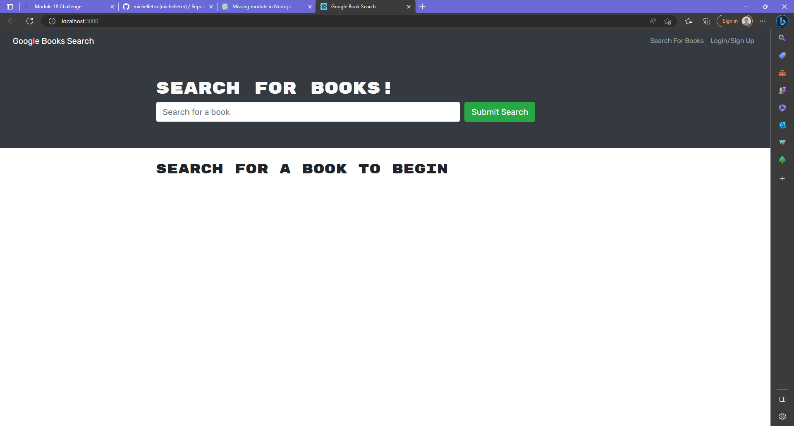

# book-search-engine

## Description

This is a  MERN Stack book search engine that allows a user to search for books using the Google Books api. User is able to save the book they choose to their profile.
## Usage

Begin by signing up for an account. Once you have an account, you can log in and search for books. Once you search, each book will populate a card that allows you to save that book to your profile. You can check your collection of books
## Demo

## Credits

Starter code and templates were provided by instructor.

## License

This application is licensed under the MIT license.